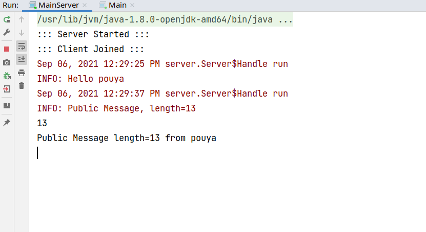
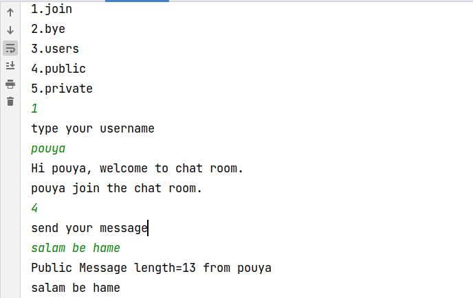

# commandline-chatroom

This Program is written for computer networking course

# about

This Application is commandline chatroom support non-blocking I/O using java thread api also for connection used Socket
and ServerSocket api.

# features

1. List Of Users
2. Private Message
3. Public Message
4. Join/Disjoint

# views

